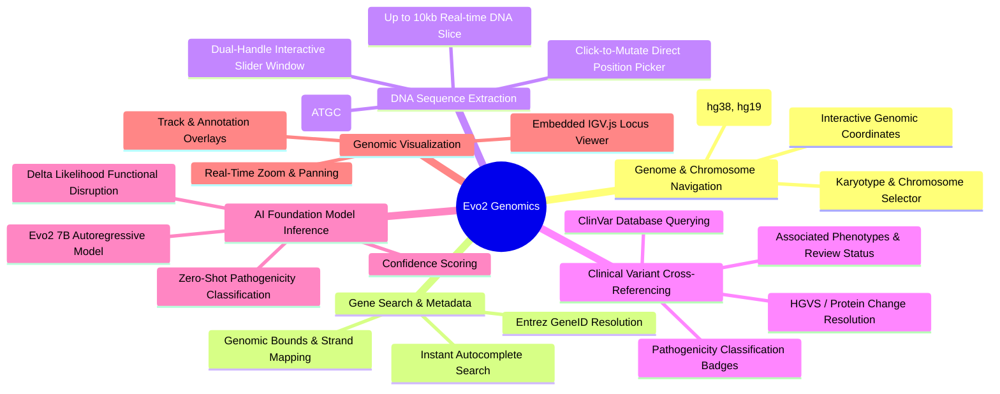
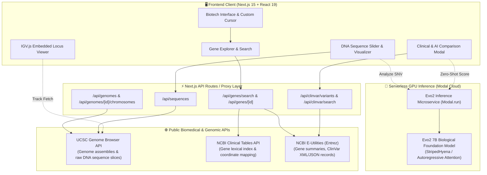

# 🧬 Evo2 Genomic Variant Analysis Platform

> **Next-Generation Genomic Variant Interpretation & AI Foundation Model Analytics**  
> *Bridging clinical genomics databases (NCBI / ClinVar / UCSC) with state-of-the-art biological foundation models (Evo2) for zero-shot variant pathogenicity prediction.*

---

## 📑 Table of Contents

- [Overview & Problem Statement](#-overview--problem-statement)
- [Key Features & Capabilities](#-key-features--capabilities)
- [System Architecture & Data Flow](#-system-architecture--data-flow)
- [Algorithmic & Scientific Core](#-algorithmic--scientific-core)
- [Technology Stack Breakdown](#-technology-stack-breakdown)
- [Project Structure](#-project-structure)
- [API Reference & Integrations](#-api-reference--integrations)
- [Installation & Local Setup](#-installation--local-setup)
- [Environment Configuration](#-environment-configuration)
- [Module HC-04: ClinVar Conflict Triage](#-module-hc-04--clinvar-conflict-triage)
- [Future Enhancements & Strategic Roadmap](#-future-enhancements--strategic-roadmap)
- [License & Acknowledgments](#-license--acknowledgments)

---

## 🔬 Overview & Problem Statement

Modern high-throughput sequencing has made whole-genome and exome sequencing fast and affordable, but interpreting genetic mutations remains a formidable bottleneck in precision medicine.

```
┌───────────────────────────────────────────────┐
│              THE GENOMICS DILEMMA             │
├───────────────────────────────────────────────┤
│  Sequencing Speed  ▶  ⚡ Exponentionally Fast │
│  Clinical Insight  ▶  ⏳ Severely Bottlenecked│
└───────────────────────────────────────────────┘
```

### 1. The VUS (Variants of Uncertain Significance) Bottleneck
Clinicians routinely discover millions of mutations whose biological impact is unknown. Because traditional functional assays take months of wet-lab testing, patients are often left without actionable diagnoses.

### 2. Limitations of Retrospective Databases
Databases such as **NCBI ClinVar** and **dbSNP** are strictly retrospective—they only catalogue previously documented, curated mutations. They cannot interpret novel, patient-specific mutations.

### 3. The Computational Barrier of Foundation Models
Biological LLMs such as **Evo2 (7-Billion parameters)** require high-end GPU infrastructure (NVIDIA H100s/A100s) with specialized CUDA setups that most medical laboratories and researchers cannot operate locally.

### 💡 The Solution: Evo2 Variant Analysis Platform
This platform bridges this gap by unifying:
1. **Live UCSC Genome Assembly streaming** (`hg38`, `hg19`),
2. **NCBI Clinical Tables & Entrez E-Utilities integration**,
3. **Interactive Integrative Genomics Viewer (IGV.js)** locus inspection,
4. **Serverless GPU-accelerated Evo2 AI Foundation Model Inference** via Modal for zero-shot pathogenicity delta scoring ($\Delta \text{Score}$).

---

## ✨ Key Features & Capabilities



- **Interactive Genomic Range Windowing**: Dual-handle interactive slider permitting smooth exploration of gene bounds and precise DNA sequence sub-ranges (up to 10,000 base pairs).
- **Nucleotide-Level Sequence Inspector**: ATGC nucleotide color-coding with single-click position selection and instant reference base auto-detection.
- **Dual-Track Clinical & AI Analysis**:
  - **Empirical Clinical Track**: Queries NCBI ClinVar for real-world curated classifications (Pathogenic, Benign, VUS, Conflicting).
  - **Predictive AI Track**: Evaluates arbitrary single nucleotide variants (SNVs) against the Evo2 foundation model to compute mathematical functional disturbance.
- **Biotech Glassmorphic Interface**: Custom UI built with Tailwind CSS v4, featuring dynamic ambient DNA wave loaders, subtle interactive glowing cursors, and responsive Framer Motion micro-animations.

---

## 🏛️ System Architecture & Data Flow

The platform utilizes a modern decoupled architecture: a reactive Next.js 15 client communicating with Next.js edge API proxies, connecting to public genomic databases and serverless GPU AI endpoints.



---

## 🧠 Algorithmic & Scientific Core

### 1. Zero-Shot Variant Effect Prediction (Evo2)
The core predictive capability relies on **Evo2**, a biological foundation model trained across single-cell genomes, prokaryotes, and eukaryotes.

Evo2 evaluates the biological likelihood of a nucleotide sequence by computing the autoregressive log-likelihood of reference ($S_{\text{ref}}$) versus mutated ($S_{\text{alt}}$) contexts:

$$\Delta \mathcal{L} = \log P(S_{\text{alt}} \mid \theta) - \log P(S_{\text{ref}} \mid \theta)$$

- **$\Delta \mathcal{L} \approx 0$**: Neutral / Benign mutation (sequence likelihood remains unaltered).
- **$\Delta \mathcal{L} \ll 0$**: Deleterious / Pathogenic mutation (significant disruption of evolutionary conservation, regulatory motifs, or protein translation).
- **Classification Confidence**: Derived from the posterior probability distribution over alternative alleles at the target coordinate.

```
Reference Sequence:  ... G C C T [A] G C T A ...  -> Log-Likelihood: -12.4
Mutated Sequence:    ... G C C T [G] G C T A ...  -> Log-Likelihood: -18.9
-------------------------------------------------------------------------
Delta Score (ΔL):    -6.5  (Significant disruption -> Classified: PATHOGENIC)
```

### 2. Coordinate System Normalization & Gene Boundary Resolution
Genomic coordinates vary across APIs:
- **UCSC API**: 0-based, half-open indexing (`[start-1, end)`).
- **ClinVar & HGVS**: 1-based, fully closed indexing (`[start, end]`).
- **NCBI Entrez**: Strand-aware intervals (`chrstart`, `chrstop`).

The platform's normalization engine dynamically standardizes intervals:

$$\text{Range}_{\text{view}} = \begin{cases} [\min(\text{chrstart}, \text{chrstop}), \min(\text{chrstart}, \text{chrstop}) + 10{,}000] & \text{if } \text{Size} > 10{,}000 \\ [\min(\text{chrstart}, \text{chrstop}), \max(\text{chrstart}, \text{chrstop})] & \text{otherwise} \end{cases}$$

---

## 💻 Technology Stack Breakdown

| Layer | Technologies | Purpose |
| :--- | :--- | :--- |
| **Framework** | Next.js 15 (App Router), React 19, TypeScript 5.8 | High-performance server components, edge API routing, and strict type safety |
| **Styling & Theme** | Tailwind CSS v4, PostCSS, Custom Biotech CSS System | Modern responsive styling with mint/emerald glassmorphic theme and CSS variables |
| **Animations** | Framer Motion 12, Spring Physics, CSS Keyframe Animations | Smooth layout transitions, slide reveals, pulsating DNA helix animation |
| **Genomic Visualizer** | IGV.js 2.15.6 (Integrative Genomics Viewer) | Interactive client-side genome visualization track with annotation overlays |
| **UI Components** | Radix UI (`@radix-ui/react-select`, `react-tabs`, `react-slot`), Lucide Icons | Accessible, accessible primitives and icons |
| **Validation** | Zod, `@t3-oss/env-nextjs` | Runtime environment and API payload validation |
| **Upstream APIs** | UCSC Genome REST API, NCBI E-Utilities, NCBI Clinical Tables | Genome assemblies, chromosome sizes, raw nucleotide strings, ClinVar summaries |
| **AI Inference** | Evo2 Foundation Model (Arc Institute), Modal Serverless GPU | Zero-shot genomic sequence log-likelihood & SNV pathogenicity scoring |

---

## 📂 Project Structure

```
evolution-genomics/
└── Evolution/
    └── variant-analysis-evo2/
        ├── evo2.excalidraw                 # System architecture & whiteboard diagrams
        ├── .gitmodules                     # Submodule link to ArcInstitute/evo2 backend
        ├── netlify.toml                    # Netlify deployment configuration
        ├── vercel.json                     # Vercel deployment configuration
        └── evo_update_frontend/            # Next.js Fullstack Web Application
            ├── package.json                # Dependencies and build scripts
            ├── tsconfig.json               # TypeScript strict configuration
            ├── next.config.js              # Next.js build and routing options
            ├── .env.example                # Template for environment variables
            ├── src/
            │   ├── app/
            │   │   ├── layout.tsx          # Root layout with IGV.js script & font configuration
            │   │   ├── page.tsx            # Main landing & portal entrypoint
            │   │   ├── homepage/
            │   │   │   └── page.tsx        # Genome & Gene search workspace page
            │   │   └── api/                # Edge API Proxies
            │   │       ├── genomes/        # UCSC available assemblies & chromosome routes
            │   │       ├── genes/          # NCBI gene search & analysis aggregation routes
            │   │       ├── sequences/      # UCSC raw DNA nucleotide sequence slice fetcher
            │   │       └── clinvar/        # ClinVar search, variant lists, & detail analysis
            │   ├── components/             # React Client Components
            │   │   ├── home.tsx            # Interactive landing page with problem statements & impact
            │   │   ├── homepage.tsx        # Core search & chromosome browsing workspace
            │   │   ├── gene-viewer.tsx     # Unified Gene Inspector container
            │   │   ├── gene-sequence.tsx   # Dual-slider DNA sequence extraction & base picker
            │   │   ├── gene-information.tsx# Gene metadata, organism, and genomic bounds
            │   │   ├── known-variants.tsx  # ClinVar variant table with instant detail enrichment
            │   │   ├── variant-analysis.tsx# SNV submitter & model prediction engine
            │   │   ├── variant-viewer.tsx  # IGV.js genome browser integration component
            │   │   ├── variant-comparison-modal.tsx # NCBI clinical evidence comparison modal
            │   │   ├── dna-loader.tsx      # SVG/CSS wave-animated DNA loader
            │   │   ├── biotech-background.tsx # Ambient background graphics
            │   │   ├── custom-cursor.tsx   # Smooth spring-following cursor & dot
            │   │   ├── cursor-glow.tsx     # Reactive mouse glow effect
            │   │   └── ui/                 # Reusable Radix UI design system primitives
            │   ├── server/                 # Server-side utilities & NCBI SDK
            │   │   ├── ncbi.ts             # Entrez E-Utilities, UCSC, & Clinical Tables SDK
            │   │   └── normalize-local-storage.ts # Safe SSR storage shim
            │   ├── utils/                  # Client utility helpers
            │   │   ├── genome-api.ts       # Typed client-side API client functions
            │   │   └── coloring-utils.ts   # ATGC nucleotide & clinical badge colorizers
            │   ├── styles/
            │   │   └── globals.css         # Tailwind v4 theme, biotech tokens, & IGV overrides
            │   └── env.js                  # Type-safe environment validation via Zod
```

---

## 🔌 API Reference & Endpoints

### 1. Internal Next.js API Routes

| Endpoint | Method | Params / Payload | Description |
| :--- | :--- | :--- | :--- |
| `/api/genomes` | `GET` | — | Retrieves supported UCSC genome assemblies grouped by organism (e.g., Human `hg38`, `hg19`). |
| `/api/genomes/[genomeId]/chromosomes` | `GET` | `genomeId` | Fetches filtered, naturally sorted list of canonical chromosomes and their lengths. |
| `/api/genes/search` | `GET` | `?q=<term>&genome=<id>` | Autocompletes gene symbols, names, and chromosomal loci via NCBI Clinical Tables. |
| `/api/genes/[geneId]` | `GET` | `geneId` | Retrieves exact genomic start/stop coordinates and summary for a specific Entrez Gene ID. |
| `/api/genes/analysis` | `POST` | `{ gene, genomeId }` | Batch fetches gene details, initial 10kb DNA sequence slice, and top 20 ClinVar variants. |
| `/api/sequences` | `GET` | `?chrom=&start=&end=&genomeId=` | Streams uppercase nucleotide sequence string from UCSC Genome Browser. |
| `/api/clinvar/variants` | `POST` | `{ chrom, geneBound, genomeId }` | Fetches all ClinVar variants intersecting the specified chromosome boundary. |
| `/api/clinvar/search` | `POST` | `{ chromosome, position, alternative, genomeId }` | Finds specific ClinVar record matching genomic position and mutated allele. |
| `/api/clinvar/analysis` | `POST` | `{ clinvarId, gene }` | Fetches deep clinical evidence, review status, submitter count, HGVS, and trait names. |

### 2. Evo2 Foundation Model GPU Endpoint

```http
POST https://gprincegupta0210--variant-analysis-evo2-evo2model-analyze-dev.modal.run
Content-Type: application/json

{
  "chromosome": "chr17",
  "variant_position": 43044295,
  "alternative": "G",
  "genome": "hg38"
}
```

#### Sample Response:
```json
{
  "position": 43044295,
  "reference": "A",
  "alternative": "G",
  "delta_score": -4.8219,
  "prediction": "Pathogenic",
  "classification_confidence": 0.942
}
```

---

## 🚀 Installation & Local Setup

### Prerequisites
- **Node.js**: `v20.x` or `v22.x` (LTS recommended)
- **npm**: `v10.x` or higher (or `pnpm` / `yarn` / `bun`)

### Step-by-Step Setup

1. **Clone the repository with submodules**:
   ```bash
   git clone --recurse-submodules https://github.com/your-username/evolution.git
   cd evolution/Evolution/variant-analysis-evo2/evo_update_frontend
   ```

2. **Install dependencies**:
   ```bash
   npm install
   ```

3. **Configure Environment Variables**:
   ```bash
   cp .env.example .env
   ```
   Ensure `.env` contains the Evo2 Model API endpoint:
   ```env
   NEXT_PUBLIC_ANALYZE_SINGLE_VARIANT_BASE_URL="https://gprincegupta0210--variant-analysis-evo2-evo2model-analyze-dev.modal.run"
   NODE_ENV="development"
   ```

4. **Run the Development Server**:
   ```bash
   npm run dev
   ```
   Open [http://localhost:3000](http://localhost:3000) in your browser.

5. **Type Checking & Linting**:
   ```bash
   npm run typecheck
   npm run lint
   ```

---

## ⚖️ Module HC-04 — ClinVar Conflict Triage

> **Clinical Operational Prioritization System for Conflicting Genomic Interpretations**  
> *Dedicated triage queue predicting the probability ($0.0 \le P \le 1.0$) that a ClinVar variant record contains conflicting clinical submissions requiring expert review.*

### ⚠️ Scope & Operational Framing
HC-04 is explicitly an **operational workload triage system** designed for clinical laboratory variant scientists and curation panels.  
- **What it does**: Prioritizes ClinVar records likely to contain contradictory clinical interpretations (e.g., pathogenic vs. VUS) to optimize human expert curation queues.
- **What it does NOT do**: It is **not** a clinical diagnostic or pathogenicity determination tool. It does not predict disease risk or patient phenotypes.

```
┌────────────────────────────────────────────────────────────────────────┐
│                   HC-04 OPERATIONAL TRIAGE PIPELINE                    │
├────────────────────────────────────────────────────────────────────────┤
│  ClinVar (Chr 21 & 22)  ▶  Feature Pipeline (Zero Leakage)             │
│  Permitted Inputs Only  ▶  Calibrated Model (HistGB / LightGBM)        │
│  Strict Probability     ▶  Triage Queue ($P \in [0, 1]$) & Dashboards  │
└────────────────────────────────────────────────────────────────────────┘
```

### 🧬 Dataset & Scope
- **Source**: Official NCBI monthly release `variant_summary_2026-08.txt.gz` from the [ClinVar Tab-Delimited Archive](https://ftp.ncbi.nlm.nih.gov/pub/clinvar/tab_delimited/archive/).
- **Inclusion Criteria**:
  - Assembly: `GRCh38`
  - Chromosomes: `21` and `22` only
  - Gene filter: Valid non-empty `GeneSymbol` (`GeneSymbol != ''`)
  - Classification filter: Valid clinical significance (`ClinicalSignificance != '-'`)
- **Target Label**: `CONFLICT = 1` if `'conflicting'` in `ClinicalSignificance.lower()`, else `0`.

### 🛡️ Feature Whitelist & Zero Data Leakage Enforcement
To ensure scientific integrity and eliminate target leakage:
- **Permitted Inputs**:
  - `Type` (e.g., single nucleotide variant, deletion, duplication)
  - `GeneSymbol` (standard HGNC symbol)
  - `Chromosome` (`21`, `22`)
  - `Start`, `Stop` (genomic coordinates, GRCh38)
  - `OriginSimple` (e.g., germline, somatic, unknown)
  - `NumberSubmitters` (submitter volume)
- **Engineered Features**:
  - `VariantLength` ($\max(1, \text{Stop} - \text{Start} + 1)$)
  - `IsSingleNucleotide` (boolean indicator)
  - `LogNumberSubmitters` ($\log(1 + \text{NumberSubmitters})$)
  - Fold-fitted frequency encodings (`GeneFrequency`, `TypeFrequency`, `OriginFrequency`)
- **Strictly Blacklisted / Forbidden**:
  - ❌ `ClinicalSignificance` (used *only* to construct training labels, never an input)
  - ❌ `ReviewStatus` (submission review status)
  - ❌ `VariationID` (ClinVar internal identifier)
  - ❌ Evo2 model features & DNA nucleotide sequences
  - ❌ External conflict databases or lookups
- **Leakage Prevention**: All category frequency encoders and scalers are fitted strictly inside the training fold and applied to validation/test folds without out-of-fold visibility.

### 🔬 Candidate Models & Probability Calibration
The research suite compares four distinct candidate architectures:
1. **Scaled Logistic Regression** (L2-regularized linear baseline with StandardScaler)
2. **LightGBM Classifier** (Gradient boosted trees with leaf-wise expansion)
3. **CatBoost Classifier** (Ordered boosting with native categorical handling)
4. **HistGradientBoosting Classifier** (Fast histogram-based gradient boosting)

All models undergo probability calibration (Platt Sigmoid / Isotonic Regression) to guarantee calibrated probabilities bounded strictly in $[0.0, 1.0]$.

### 📊 Evaluation Metrics
- **Average Precision (AP)**: Primary metric under significant class imbalance (~15% conflict prevalence).
- **Recall@10%**: Fraction of total conflicting variants captured within the top 10% highest-priority triage queue.
- **Brier Score**: Quadratic accuracy of probabilistic predictions.
- **Calibration Utility**: Defined as $1 - \text{Brier Score}$.
- **Mean Per-Gene AP**: Average Precision evaluated independently on genes with $\ge 20$ records and both classes present.

### 🧪 Research Studies & Empirical Validation
- **Feature Ablation**: Isolates incremental gains from Model A (raw metadata) to Model B (+numerical/log submitters) to Model C (+training-fit frequency priors).
- **Gene Generalization**: Compares models trained with vs. without `GeneSymbol` to quantify generalizability on uncharacterized novel loci.
- **Subgroup Robustness**: Stratifies performance across chromosomes (21 vs 22), variant types (SNVs vs indels), submitter densities (low vs high), and gene volumes.
- **Error Analysis**: Documents false-positive and false-negative drivers in `ERROR_ANALYSIS.md`.

### 💻 Running the HC-04 Pipeline
```bash
# 1. Download official ClinVar archive
python -m hc04.download

# 2. Filter Chr 21 & 22 and extract features
python -m hc04.preprocess

# 3. Train models, run benchmarks, and generate publication figures
python -m hc04.train

# 4. Run automated test suite
pytest tests/hc04/ -v

# 5. Access interactive web dashboard
# Navigate to: http://localhost:3000/clinvar-triage
```

---

## 🔮 Future Enhancements & Strategic Roadmap

```mermaid
gantt
    title Evolutionary Genomics Roadmap
    dateFormat  YYYY-Q#
    section Phase 1 (Core Platform)
    UCSC & NCBI E-Utilities Integration       :done, p1, 2025-Q4, 2026-Q1
    Evo2 7B Zero-Shot API Deployment           :done, p2, 2026-Q1, 2026-Q2
    IGV.js Embedded Viewer Integration        :done, p3, 2026-Q1, 2026-Q2
    section Phase 2 (Advanced AI & Multi-Omics)
    Batch VCF File Upload & Annotation        :active, p4, 2026-Q3, 2026-Q4
    AlphaFold 3 / 3D Protein Missense Viewer  :p5, 2026-Q4, 2027-Q1
    Redis / Upstash Genome Caching Layer      :p6, 2026-Q3, 2026-Q4
    section Phase 3 (Clinical Enterprise)
    ClinVar Automated Reclassification Alerts:p7, 2027-Q1, 2027-Q2
    Multi-Gene Pathway Disruption Scoring    :p8, 2027-Q2, 2027-Q3
```

### Proposed Improvements:
1. **High-Throughput VCF Batch Processing**: Support drag-and-drop `.vcf` / `.vcf.gz` file parsing to score thousands of variants in parallel via asynchronous Modal queues.
2. **3D Structural Superimposition**: Integrate PyMOL / 3Dmol.js to render AlphaFold protein structures and highlight residues altered by missense mutations.
3. **Sub-Millisecond Edge Caching**: Add Upstash Redis / Cloudflare KV caching for UCSC sequence slices and NCBI Entrez summaries to eliminate external rate limits.
4. **Automated Variant Re-evaluation Notifications**: Track saved patient VUS mutations and send webhook/email alerts when newly published ClinVar records update their clinical classification.

---

## 📄 License & Acknowledgments

- **License**: Released under the [MIT License](LICENSE.MD).
- **AI Foundation Model**: Built on the **Evo2** architecture created by the [Arc Institute](https://arcinstitute.org/) and collaborators.
- **Genomic Data Providers**:
  - [UCSC Genome Browser](https://genome.ucsc.edu/)
  - [National Center for Biotechnology Information (NCBI)](https://www.ncbi.nlm.nih.gov/)
  - [ClinVar Database](https://www.ncbi.nlm.nih.gov/clinvar/)
  - [Integrative Genomics Viewer (IGV.js)](https://github.com/igvteam/igv.js/)
